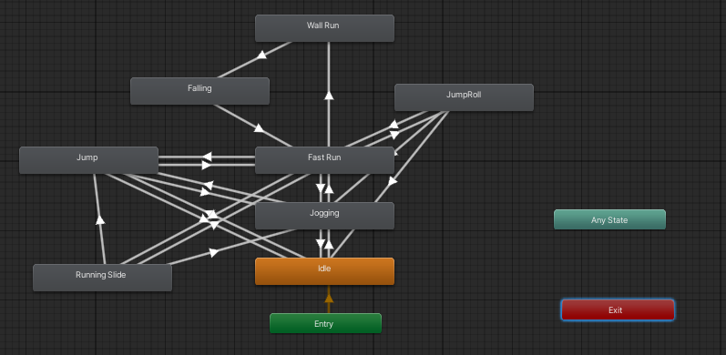

## Table Of Contents

1. [Introduction](#introduction)
2. [Key Focuses](#challenges-overview)
3. [Video](#video-showcase)
4. [License](#license)

## Introduction

This is my C# Unity gameplay project that focuses on player movement and parkour animations.
A simple project that allowed me to develop the basics of taking an inanimate character model, and making use of both
Unity's animator controller and C# scripting to blend in various animations together.
Inspired by the gameplay of games that utilizes parkour animations such as Assassins Creed, Mirror's Edge etc.

## Key Focuses
### 1. Animator Controller
- Managed the animation states for all player mechanics.
- Transitions between different movements based on player input.

### 2. C# Scripting and Animation Control
- Scripting allowed for more dynamic and manual changes to the animation states. 
- `AnimatorStateInfo()` to track the progress of animations and trigger actions when an animation reaches a certain point.
- `SetBool()` to controll the parameters in the animator controller.

### 3. Quaternion and SmoothDamp for Rotation
- `Quaternion.Slerp()` and `Quaternion.Euler()` to help rotate the player model smoothly based on camera direction.
- `Mathf.SmoothDampAngle()` for gradual camera rotation to prevent 'snappy' movements.

### 4. Raycasting
- Implemented raycasting to detect walls and obstacles in front of the player. Used mainly for wall-running and jump rolls.
- Prevented player from floating after animations that creates displacement along the y-axis.

### 5. Rigidbody and Collisions
- Using `Rigidbody` for physics-based actions.
- Collisions ensured better interactiosn with walls and obstacles.
- Utilized compound colliders for the players due to its complex model.

## Demo

## License

### Mixamo Assets:
This project includes character model and animations sourced from [Mixamo](https://www.mixamo.com/#/).
These assets were used solely for educational and non-commercial purposes.

### Unity:
This project utilizes the Unity Game Engine. For more information, visit [Unity's License Page](https://support.unity.com/hc/en-us/categories/201268913-Licenses)
